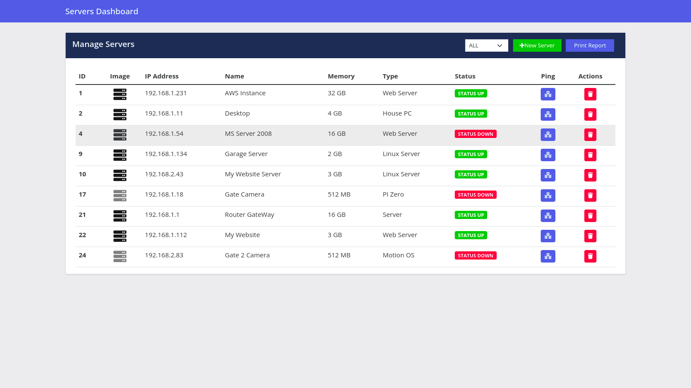
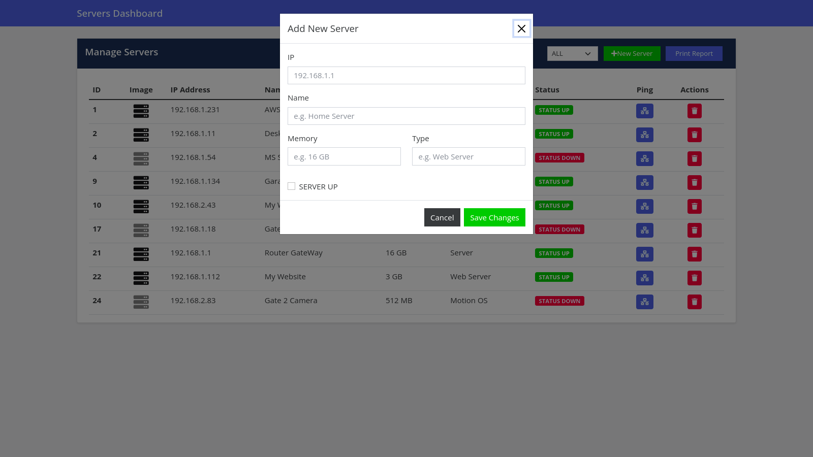

## Servers Manager

is an web application used to manager person servers like his home camera servers, website server, and others to check if it up or down.

built with `django` as the backend using `djangorestframework` and `React` as the frontend which can be served with any server like `apache2`, `nginx` or even a static `flask` server.

in the backend folder run:
`$ pip install -r requirement.txt`
`$ python manage.py runserver`

in the frontend folder run:
`$ npm start`

### Demo and Screenshots

